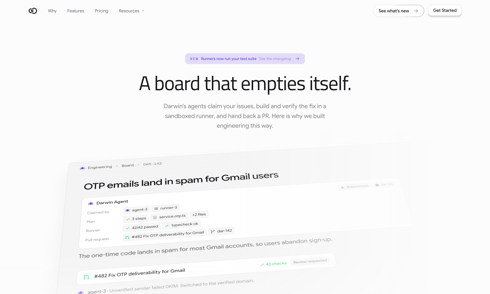
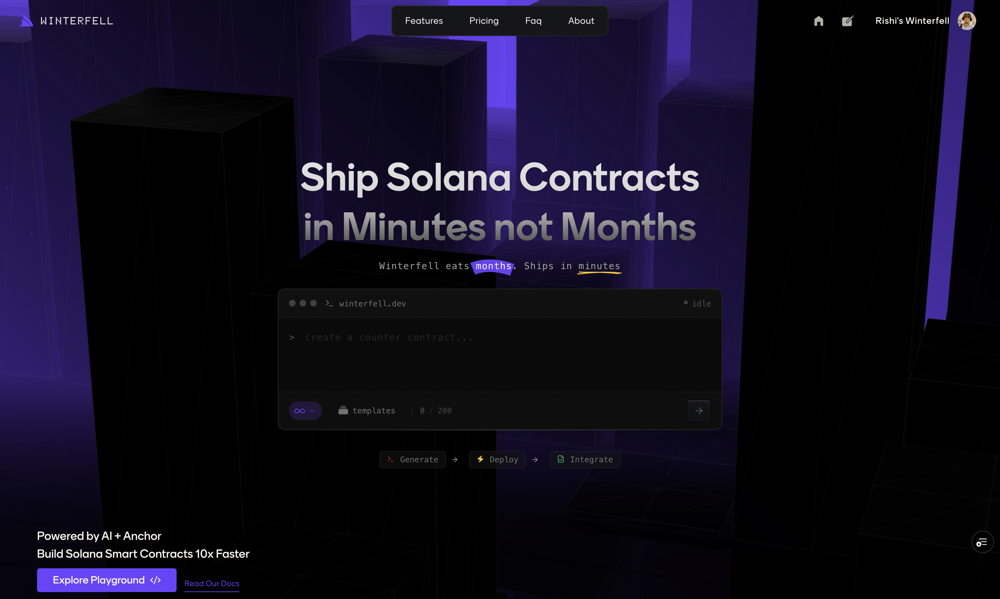
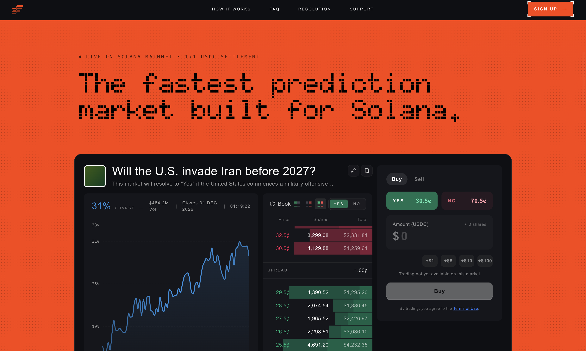
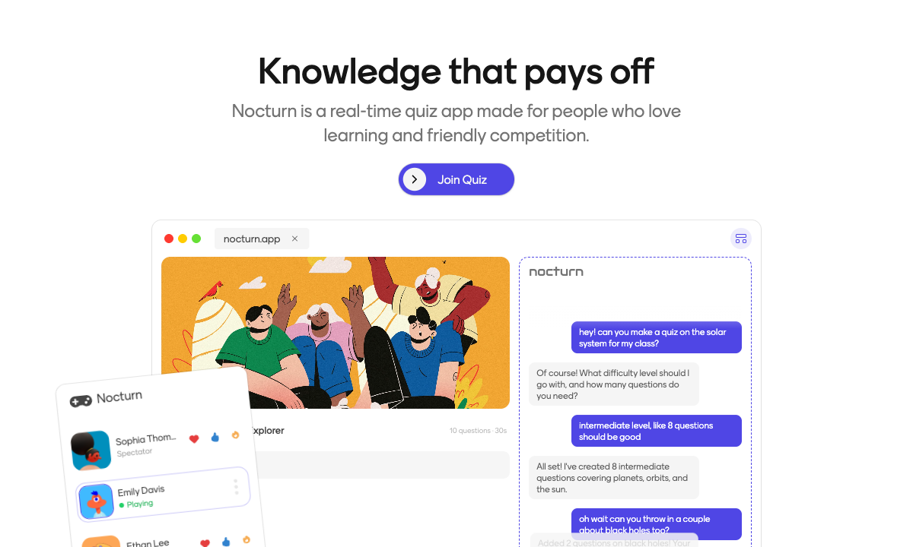

Engineer at <a href="https://heylomi.ai">Lomi</a>

I'm a frontend engineer who cares about how software feels as much as how it works. I spend my time on interfaces, motion, and the small micro-interactions that make a product feel considered.

Away from the keyboard I'm usually learning Rust or sharpening my design eye.

 

### Work

<table width="100%">
  <tr>
    <td width="50%" valign="top">
      
        
      <b><a href="https://heydarwin.app">Darwin</a></b> 
      An agent picks up an issue, works in its own sandbox, and opens the pull request.
    </td>
    <td width="50%" valign="top">
      
        
      <b><a href="https://winterfell.dev">Winterfell</a></b> 
      Write, test and deploy Solana contracts from the browser. Superteam India hackathon winner.
    </td>
  </tr>
  <tr>
    <td width="50%" valign="top">
      
        
      <b><a href="https://highgarden.trade">HighGarden</a></b> 
      A prediction market built on Solana, made to settle fast. Trade yes/no outcomes in USDC.
    </td>
    <td width="50%" valign="top">
      
        
      <b><a href="https://nocturn.app">Nocturn</a></b> 
      A real-time quiz platform with on-chain rewards, synced over WebSockets and Redis.
    </td>
  </tr>
</table>

 

### Experience

**Engineer at [Lomi](https://heylomi.ai)** 
Lomi is a team workspace that puts chat, meetings, documents, and tool integrations (GitHub, Google Workspace) into one shared memory. It can search across everything the team has said, transcribe and take notes on meetings, organize work with channels and labels, and turn conversations into living documents the team edits together.

**Open-source contributor at [Twenty](https://github.com/twentyhq/twenty)** &nbsp;·&nbsp; `2026` 
Added recursive text extraction for note previews so text, links, and nested Blocknote nodes render consistently.

 

### Stack

`TypeScript` `Next.js` `React` `Tailwind CSS` `Node.js` `Socket.IO` `PostgreSQL` `Redis` `Motion` `Docker` `Rust` `AWS`

 

### Reach me

  
  &nbsp;&nbsp;
  <a href="https://github.com/piyush-rj" title="GitHub">
    <picture>
      <source media="(prefers-color-scheme: dark)" srcset="https://img.icons8.com/ios-glyphs/60/ffffff/github.png">
      
    </picture>
  </a>
  &nbsp;&nbsp;
  <a href="https://x.com/piyushc2p" title="X">
    <picture>
      <source media="(prefers-color-scheme: dark)" srcset="images/twitter.svg">
      
    </picture>
  </a>
  &nbsp;&nbsp;
  
  &nbsp;&nbsp;
  

